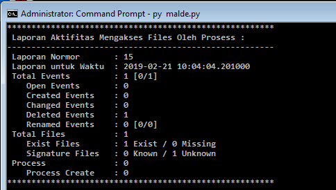

# malde
Project ini merupakan tool yang dibangun untuk project Penelitian  Malware Detection Based on Application Behavior.
Metode deteksi malware yang digunakan adalah Behavior Based Detection, sedangkan implementasi menggunakan python, OS yang digunakan untuk menjalankan project ini adalah sistem operasi windows 7

# Python version : 
Project ini menggunakan python versi : python 2.7.15

# The Packages/Module required : 
Beberapa modul yang diperlukan untuk menjalankan script ini adalah sebagai berikut : 
- colorama (0.3.9)
- Pillow (5.1.1)
- pip (9.0.3)
- psutil (1.0.1) -- (main modul)
- pywin32 (223) -- (main modul)
- setuptools (39.0.1)
- termcolor (1.1.0)
- winappdbg (1.5) -- (main modul)

# Main Script and HowTo:
Script utama adalah file `malde.py`, script utama dijalankan pada cmd

# Command : 
Perintah menjalankan script, buka cmd dan arahkan ke direktori script lalu ketik perintah : 
`python malde.py` lalu enter

# Screenshot : 
Berikut merupakan contoh berupa hasil screenshot : 

